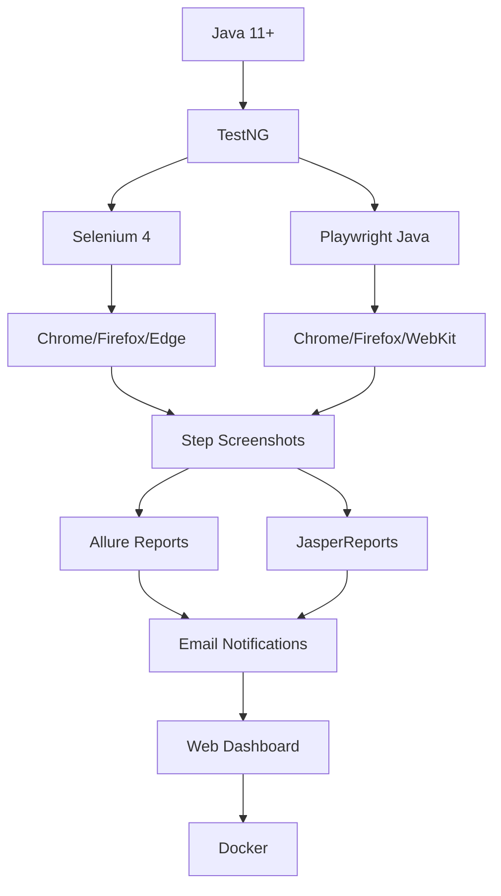

# AutomationTool 🚀

**AutomationTool** is an enterprise-grade test automation platform that allows you to **generate, edit, and execute test cases** using both **Selenium** and **Playwright**. Built with **Java**, **Servlets**, and **TestNG**, it provides a complete solution for modern test automation needs.

## ✨ **Key Features**

| Feature | Description |
|---------|-------------|
| **🧪 Dual Framework Support** | Run test cases with **Selenium** or **Playwright** |
| **⏰ Scheduled Execution** | Schedule test runs using cron-like expressions |
| **📊 Advanced Reporting** | **Allure** + **JasperReports** with rich visualizations |
| **📧 Mail Notifications** | Automatic email alerts on test completion/failure |
| **🔧 Framework Extensibility** | Extend with your custom automation frameworks |
| **🐳 Docker Ready** | Containerized deployment for CI/CD pipelines |
| **📸 Step-by-Step Screenshots** | Automatic screenshots attached to every report |
| **⚡ Web UI** | Modern JSP/Servlet-based dashboard |

## 🎯 **Use Cases**

- **Cross-browser testing** across Chrome, Firefox, Safari, Edge
- **Mobile web testing** with responsive frameworks
- **Regression testing** suites with scheduling
- **CI/CD integration** via Docker and REST APIs
- **Team collaboration** with shared test repositories

## 🚀 **Quick Start**

### **1. Clone & Build**
```bash
git clone https://github.com/yourusername/AutomationTool.git
cd AutomationTool
mvn clean package -DskipTests
```

### **2. Deploy to Tomcat**
```bash
# Copy WAR to Tomcat
cp target/AutomationTool.war ~/tomcat/webapps/

# Start Tomcat
~/tomcat/bin/startup.sh
```

### **3. Access Dashboard**
```
http://localhost:8080/AutomationTool/
```

### **4. Docker (Alternative)**
```bash
docker build -t automationtool .
docker run -p 8080:8080 automationtool
```

## 📋 **Test Case Workflow**

```
1. Create/Edit → JSON/YAML Test Definition
2. Configure → Browser + Framework (Selenium/Playwright)
3. Schedule → Cron-based execution
4. Execute → Step-by-step with screenshots
5. Review → Allure + Jasper reports
6. Notify → Email with results + screenshots
```

## 🛠 **Tech Stack**



## 📁 **Project Structure**

```
AutomationTool/
├── src/main/java/
│   ├── com.automation/
│   │   ├── servlet/     # Web controllers
│   │   ├── executor/    # Test runners
│   │   ├── reporter/    # Allure/Jasper
│   │   └── model/       # Test case models
├── src/main/webapp/
│   ├── jsp/             # UI pages
│   ├── css/             # Styles
│   └── js/              # Client-side logic
├── test/                # Sample test cases
├── docker/              # Dockerfiles
└── config/              # Email + cron configs
```

## 🔧 **Configuration**

### **Email Notifications** (`config/email.properties`)
```properties
smtp.host=smtp.gmail.com
smtp.port=587
smtp.username=your-email@gmail.com
smtp.password=your-app-password
notify.on.failure=true
notify.on.success=false
```

### **Test Scheduling** (`config/scheduler.xml`)
```xml
<scheduler>
    <job name="daily-regression" cron="0 0 2 * * ?">
        <test-suite>regression.xml</test-suite>
    </job>
</scheduler>
```

## 📈 **Reporting Dashboard**

| Report Type | Features |
|-------------|----------|
| **Allure** | Step traces, screenshots, trends |
| **Jasper** | PDF/Excel exports, charts |
| **Live Logs** | Real-time execution monitoring |
| **API Reports** | JSON endpoints for CI tools |

## 🤝 **Extending Your Framework**

```java
// Custom framework integration
public class CustomFrameworkExecutor implements TestExecutor {
    @Override
    public TestResult execute(TestCase testCase) {
        // Your custom logic here
        return executeCustom(testCase);
    }
}
```

Register in `web.xml`:
```xml
<servlet>
    <servlet-name>CustomExecutor</servlet-name>
    <servlet-class>com.yourcompany.CustomFrameworkExecutor</servlet-class>
</servlet>
```

## 🐳 **Docker Support**

### **Development**
```bash
docker-compose up -d
```

### **Production**
```dockerfile
FROM tomcat:9.0-jdk11
COPY target/AutomationTool.war /usr/local/tomcat/webapps/
EXPOSE 8080
```

## 📊 **Demo Screenshots**

| Dashboard | Test Runner | Allure Report |
|-----------|-------------|---------------|
|  |  |  |

## 🔗 **APIs**

```bash
# List test cases
curl http://localhost:8080/AutomationTool/api/tests

# Run test suite
curl -X POST http://localhost:8080/AutomationTool/api/run \
  -H "Content-Type: application/json" \
  -d '{"suite":"regression.xml","browser":"chrome"}'

# Get report
curl http://localhost:8080/AutomationTool/api/report/allure
```

## 💬 **Support**

- **Issues**: [Create New Issue](https://github.com/yourusername/AutomationTool/issues/new)
- **Discussions**: [GitHub Discussions](https://github.com/yourusername/AutomationTool/discussions)
- **Email**: support@automationtool.com

## 📄 **License**

```
MIT License

Copyright (c) 2026 AutomationTool

Permission is hereby granted, free of charge...
```

## 🙌 **Contributing**

1. Fork the repo
2. Create feature branch (`git checkout -b feature/amazing-feature`)
3. Commit changes (`git commit -m 'Add amazing feature'`)
4. Push (`git push origin feature/amazing-feature`)
5. Open Pull Request

***

⭐ **Star this repo if you find it useful!** ⭐

***


**Built with ❤️ for the testing community**

[1](https://ppl-ai-file-upload.s3.amazonaws.com/web/direct-files/attachments/images/87438119/e83d9e97-3b27-4705-8737-b5dd295dbfb3/image.jpg)
