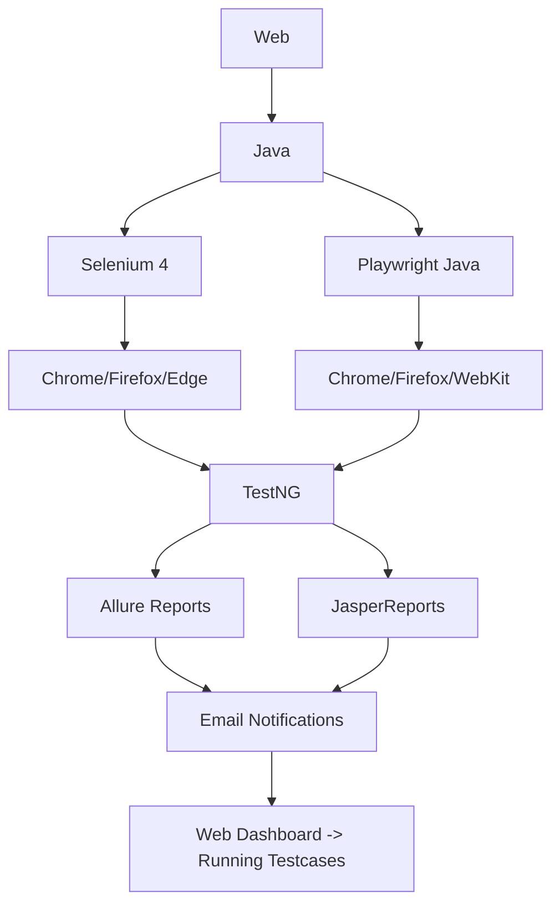
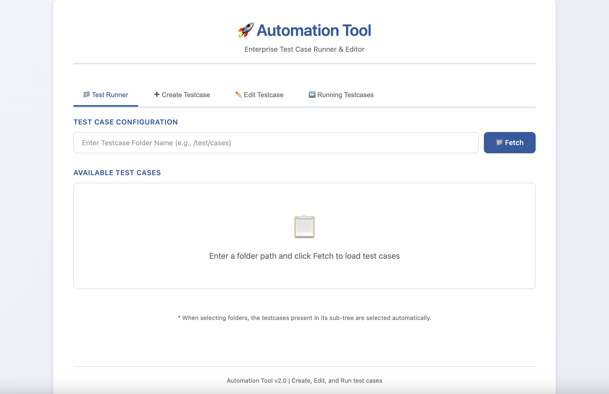
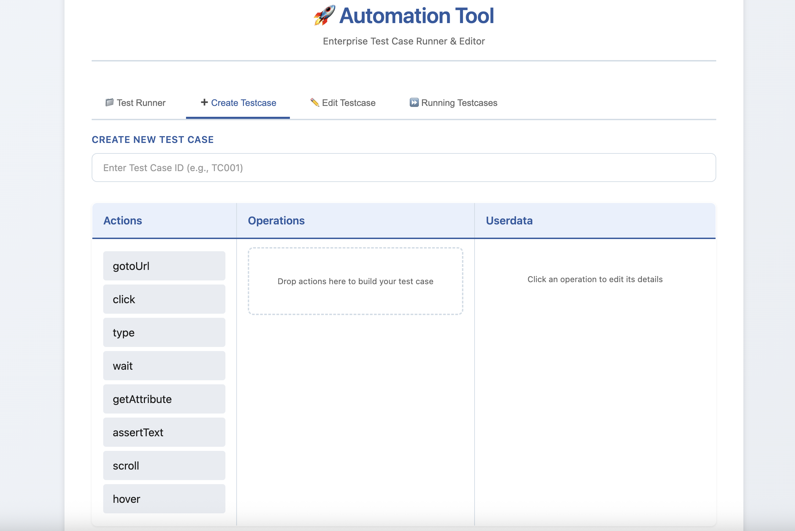
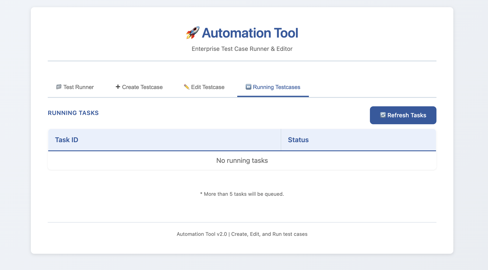
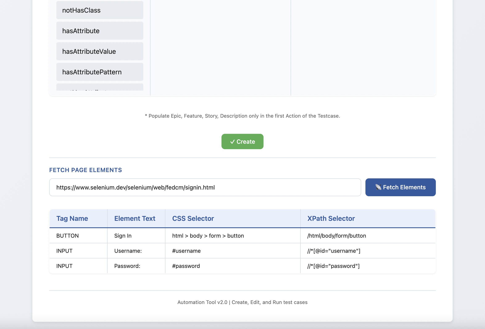

# AutomationTool 🚀

**AutomationTool** is an enterprise-grade test automation platform that allows you to **generate, edit, and execute test cases** using both **Selenium** and **Playwright**. Built with **Java**, **Servlets**, and **TestNG**, it provides a complete solution for test automation needs.

## ✨ **Key Features**

| Feature                         | Description                                                                                |
|---------------------------------|--------------------------------------------------------------------------------------------|
| **🧪 Dual Framework Support**   | Run test cases with **Selenium** or **Playwright**                                         |
| **⏰ Scheduled Execution**       | Schedule test runs using cron-like expressions                                             |
| **📊 Advanced Reporting**       | **Allure** + **JasperReports** with rich visualizations                                    |
| **🎥 Action Recorder**          | Record actions performed in browser & automatically save test case when the browser closes |
| **📧 Mail Notifications**       | Automatic email alerts on test completion/failure                                          |
| **🔧 Framework Extensibility**  | Extend with your custom automation frameworks                                              |
| **🐳 Docker Ready**             | Containerized deployment for CI/CD pipelines                                               |
| **📸 Step-by-Step Screenshots** | Automatic screenshots attached to every report                                             |
| **⚡ Web UI**                    | JSP/Servlet-based dashboard                                                                |
| **🔍 Locator Discovery**        | Lists locators for all **interactable elements**                                           |

## 🎯 **Use Cases**

- **Cross-browser testing** across Chrome, Firefox, Safari, Edge
- **Mobile web testing** with responsive frameworks
- **Regression testing** suites with scheduling
- **CI/CD integration** via Docker

## 🚀 **Quick Start**

### **1. Clone & Build**
```bash
git clone https://github.com/Ajay-Kumar-M/AutomationTool.git
cd AutomationTool
mvn clean package -DskipTests
```

### **2. Deploy to Tomcat**
```bash
# Copy WAR to Tomcat
cp target/AutomationTool.war ~/tomcat/webapps/

# Start Tomcat
~/tomcat/bin/startup.sh
```

### **3. Access Dashboard**
```
http://localhost:8080/AutomationTool/
```

## 📋 **Test Case Workflow**

```
1. Create/Edit → JSON/YAML Test Definition
2. Configure → Browser + Framework (Selenium/Playwright)
3. Execute Instantly or Schedule → execution
4. Execution → Step-by-step with screenshots
5. Review → Allure + Jasper reports
6. Notify → Email with results + screenshots
```

## 🛠 **Tech Stack**



## 📁 **Project Structure**

```
AutomationTool/
├── src/main/java/
│   ├── com.automation/
│   │   ├── servlet/     # Web controllers
│   │   ├── driver/      # Driver config
│   │   ├── executor/    # Test runners
│   │   ├── util/        # Allure/Jasper
│   │   ├── listener/    # Product / allure listeners
│   │   └── records/     # Test case models
├── src/main/webapp/
│   ├── /                # UI pages
│   ├── css/             # Styles
│   └── js/              # Client-side logic
├── testcaseData/        # Sample test cases
└── result/              # Test result reports
```

## 🔧 **Configuration**

### **Email Notifications** (`src/main/resources/email.properties`)
```properties
smtp.host=smtp.gmail.com
smtp.port=587
smtp.username=your-email@gmail.com
smtp.password=your-app-password
notify.on.failure=true
notify.on.success=false
```

### **Test Scheduling** (`src/main/resources/scheduler.xml`)
```xml
<scheduler>
    <job name="daily-regression" cron="0 0 2 * * ?">
        <test-suite>regression.xml</test-suite>
    </job>
</scheduler>
```

## 📈 **Reporting Dashboard**

| Report Type | Features |
|-------------|----------|
| **Allure** | Step traces, screenshots, trends |
| **Jasper** | PDF/Excel exports, charts |
| **Live Logs** | Real-time execution monitoring |

## 🤝 **Extending Framework**
### **Driver Config** (`src/main/resources/driver.properties`)
```properties
drivers.TYPE=PACKAGE_NAME
```

```java
import org.automation.records.DriverConfigRecord;

// Custom framework integration
public class CustomFrameworkExecutor implements Driver {
    @Override
    public void init(DriverConfigRecord driverConfigRecord) {
        // Your driver initialization logic here
    }

    public void gotoUrl(Action actionRecord) {
        // Your custom logic here
    }
}
```


## 🐳 **Docker Support**

### **Development**
```bash
docker-compose up -d
```
### **Docker Config** (`src/main/resources/driver.properties`)
```properties
docker.enable=false
docker.url=ws://0.0.0.0:3000/
docker.containerName=playwright-server
```
### **Production**
```dockerfile
FROM tomcat:10.0-jdk11
COPY target/AutomationTool.war /usr/local/tomcat/webapps/
EXPOSE 8080
```

## 🔍 **Locator Discovery**

Tool automatically scans the specified webpage and lists locators for all **interactable elements** (buttons, inputs, links, etc.).
It helps automation engineers quickly identify reliable selectors without manually inspecting the DOM.

**Supported locators include:**
- ID
- Name
- CSS Selector
- XPath

## 📊 **Demo Screenshots**

| Test Runner |
|-----------|
|  |

| Create Testcase |
|-----------|
|  |

| Runnung Tasks |
|-----------|
|  |

| Allure Report |
|-----------|
|  |

| Locator Discovery                                                                             |
|-----------------------------------------------------------------------------------------------|
|  |

**Built with ❤️ for the testing community**

